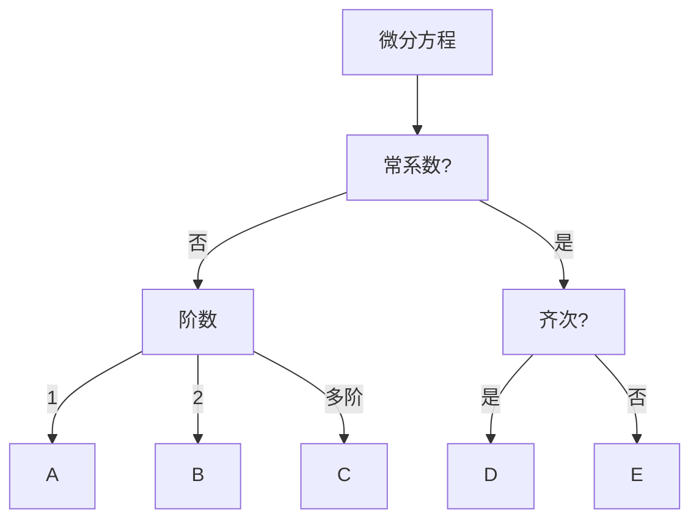

# 微积分Ⅱ

[TOC]

----------
---

## 第七章 微分方程

---

### 解题思路

---

### A.一阶微分方程

1. **分离变量**
    *   常用结论: $\displaystyle \frac{\mathrm{d}y}{\mathrm{d}x} = P(x)y \quad  \Rightarrow \quad y = Ce^{\int P(x)\mathrm{d}x}$
2. **齐次方程**

   *   令 $u = \displaystyle \frac{y}{x}$
   *   则 $\displaystyle \frac{\mathrm{d}y}{\mathrm{d}x} = P(\displaystyle \frac{y}{x}) \quad  \Rightarrow \quad x \frac{\mathrm{d}u}{\mathrm{d}x} + u = P(u)$
3. **一阶线性方程**

   *   $\displaystyle \frac{\mathrm{d}y}{\mathrm{d}x} = P(x)y + Q(x)$
   *   先求得对应齐次通解 $Y = Ce^{\int P(x)\mathrm{d}x}$
   *   再令 $C = u(x)$ 求得 $\displaystyle \frac{\mathrm{d}Y}{\mathrm{d}x} = F(u, x)$
   *   最后带入原方程求得 u

---

### B.二阶微分方程

1. **$y^{''} = f(x,y^{'})$ 型**

   *   令 $p = y^{'}$ 为所有 y 降阶
2. **$y^{''} = f(y,y^{'})$ 型**

   *   令 $p = y^{'}$ 即 $y^{''} = p\displaystyle \frac{\mathrm{d}p}{\mathrm{d}y}$
   *   再替换变量 $p\displaystyle \frac{\mathrm{d}p}{\mathrm{d}y} = f(y,p)$

---

### C.高阶微分方程

* **$\displaystyle \frac{\mathrm{d}y}{\mathrm{d}x}+ p(x)y = Q(x)y^{n}$ 型**
  * 同除 $y^{n}$ 再替换
---

### D.齐次常系数微分方程

* 解特征方程得到
  $\begin{cases}
    k重根r \quad \Rightarrow \quad e^{rx}(C_{1} + C_{2}x + \cdot \cdot \cdot  + C_{k}x^{k-1}) \\
    k对复数根 \alpha + \beta i\quad \Rightarrow \quad \\
    \quad \quad e^{\alpha x}[(C_{1} + C_{2}x + \cdot \cdot \cdot  + C_{k}x^{k-1})\cos \beta x + (C_{1} + C_{2}x + \cdot \cdot \cdot  + C_{k}x^{k-1})\sin \beta x] \\
  \end{cases}$

---

### E.非齐次常系数微分方程

* **解的结构**
  * $f(x) = A$ 的特解为 $y^{*} = a$
  * $f(x) = B$ 的特解为 $y^{*} = b$
  * 则 $f(x) = A+B$ 的特解为 $y^{*} = a+b$

1. **$f(x) = e^{\lambda x}P_{m}(x)$ 型**
    * 设 $y^{*} = x^{k}R_{m}(x)e^{\lambda x}$
    * 其中 k 为特征方程中含根 $\lambda$ 的次数
2. **$f(x) = e^{\lambda x} [P_{l}(x)\cos \omega x + Q_{n}(x) \sin \omega x]$ 型**
    * 设 $y^{*} = x^{k}e^{\lambda x}[R_{m_1}(x)  \cos \omega x + R_{m_2}(x)\sin \omega x]$
    * 其中 k 为特征方程中含根 $\lambda + \omega x$ 的次数
    * $\quad m = \max(l,n)$ 

---
---

## 第八章 向量代数与空间解析几何

----------

*   对于平面曲线上一点 P（x，y），切向量角度为 $\alpha$ ，则有 $\cos \alpha\mathrm{d}s = \mathrm{d}x$ , $\sin \alpha\mathrm{d}s = \mathrm{d}y$

----------
---

## 第十一章 曲线积分和曲面积分

----------

### 曲线积分

#### 1. 对弧长的曲线积分
   *   $\displaystyle \int_{L} f(x,y)\mathrm{d}s = \int_{\alpha}^{\beta} f[(\phi (t) \ \psi (t))] \sqrt{\phi^{'2}(t) + \psi^{'2}(t)} \mathrm{d}t$

#### 2.  对坐标的曲线积分 （考虑方向）

*   $\begin{cases}
        \displaystyle \int_{L}P\mathrm{d}x = \int_{\alpha}^{\beta} P[\phi (t),\psi(t)]\phi^{'}(t)\mathrm{d}t \\
        \\
        \displaystyle \int_{L}Q\mathrm{d}y = \int_{\alpha}^{\beta} Q[\phi (t),\psi(t)]\psi^{'}(t)\mathrm{d}t \\
    \end{cases}$

    *   方向性：从起点 $\alpha$ 到终点 $\beta$

#### 3. 两类曲线积分间的联系
   *   $\begin{cases}
    \displaystyle \int_{\Gamma} P \mathrm{d}x + Q \mathrm{d}y\ + R\mathrm{d}z\ = \int_{\Gamma} (P \cos \alpha + Q\cos \beta + R\cos \gamma)\mathrm{d}s \\
    \\
    \displaystyle \int_{\Gamma} \vec{A} \cdot \mathrm{d} \vec{r} = \int_{\Gamma} \vec{A} \cdot \vec{\tau} \mathrm{d}s\\
\end{cases}$

   * 其中：
     * $\begin{cases}
         A  = (P,Q,R) \\
         \mathrm{d}\overrightarrow{r} = (\mathrm{d}x,\mathrm{d}y,\mathrm{d}z) = (\cos \alpha \mathrm{d}s,\cos \beta\mathrm{d}s,\cos \gamma\mathrm{d}s)\\
     \end{cases}$
        （以下公式中省略向量符号）

#### 4. 格林公式

*   平面区域D的曲线边界L：D始终在L方向上的左侧

*   $\displaystyle \int_{L} P\mathrm{d}x+Q\mathrm{d}y = \iint_{D}(\frac{\partial Q}{\partial x}-\frac{\partial P}{\partial y})\mathrm{d}x\mathrm{d}y$
    *   $\nabla = \displaystyle (\frac{\partial }{\partial x}, \frac{\partial }{\partial y})$
    *   即:$\displaystyle \int_{L} A\cdot \mathrm{d}r = \iint_{D} \nabla \times A \mathrm{d}x\mathrm{d}y $
    *   注意：曲线积分中的L是区域D的全部曲线边界

*   单连通域中：
    *   曲线积分与路径无关 $\Leftarrow$ $\nabla \times A = 0$ $\Rightarrow$ $A\mathrm{d}\overrightarrow{r} $是$u(x,y)$的全微分
    *   求$u(x,y)$的两种方法：
        1.  任取$x_{0},y_{0}$, 则$u(x,y) = \displaystyle \int_{(x_{0},y_{0})}^{(x,y)} A\cdot \mathrm{d}r$
        2.  由$\begin{cases}
            \displaystyle u(x,y) = \displaystyle \int P\mathrm{d}x = \phi(x) + \psi(y)\\
            \displaystyle \int Q\mathrm{d}y = u^{'}(x,y)\\
        \end{cases}$ 求得

#### 5. 斯托克斯公式

*   斯托克斯公式是对格林公式的推广,针对于空间曲线
*   $\displaystyle \int_{\Gamma}A\cdot \mathrm{d}r = \iint_{\Sigma}\nabla \times A\cdot \mathrm{d}S$
*   空间一维单连通区域中（详见`曲面积分4`）
    *   曲线积分与路径无关 $\Leftarrow$ $\nabla \times A = 0$ $\Rightarrow$ $A\mathrm{d}\overrightarrow{r} $是$u(x,y)$的全微分
    *   $u(x,y)$ 的求法同`曲线积分4`

----------

### 曲面积分

#### 1. 对面积的曲面积分

*   $\displaystyle \iint_{\Sigma}f(x,y,z)\mathrm{d}S = \iint_{D_{xy}}f[x,y,z(x,y)]\sqrt{1+z_{x}^{2}(x,y)+z_{y}^{2}(x,y)}\mathrm{d}x\mathrm{d}y$

#### 2. 对坐标的曲面积分 (考虑方向)

*   $\displaystyle \iint_{\Sigma} R\mathrm{d}x\mathrm{d}y = \iint_{D_{xy}} R\mathrm{d}x\mathrm{d}y$
    *   方向性：$\Sigma$ 取曲面上侧

#### 3. 两类曲面积分间的联系

*   $\displaystyle \iint_{\Sigma}A \cdot \mathrm{d}\overrightarrow{S}  = \iint_{\Sigma}A\cdot \overrightarrow{n}\mathrm{d}S  $
    *   其中：
        *   $\begin{cases}
            A = (P,Q,R) \\
            \mathrm{d}\overrightarrow{S} = (\mathrm{d}y\mathrm{d}z,\mathrm{d}z\mathrm{d}x,\mathrm{d}x\mathrm{d}y) = (\cos \alpha\mathrm{d}S,\cos \beta\mathrm{d}S,\cos \gamma\mathrm{d}S)\\
        \end{cases}$
        （以下公式中省略向量符号）

#### 4.高斯公式

*   $\displaystyle \iint_{\Sigma} A\cdot \mathrm{d}S = \iiint_{\Omega} \nabla \cdot A\mathrm{d}x\mathrm{d}y\mathrm{d}z$
    *   注意：曲面积分中的 $\Sigma$ 是区域 $\Omega$ 的全部边界曲面

*   空间一维单连通区域：可以从任意一条闭曲线吹气，吹成整个空间区域
    空间二维单连通区域：任意一个闭曲面中没有洞
    *   如：
        *   环面围成的区域一维不连通二维连通
            同心球面围成的区域一维连通二维不连通

*   空间二维单连通区域中
    *   曲面积分与所取曲面无关 $\Leftarrow$ $\nabla \cdot A = 0$

#### 5. *通量与散度、环流量与旋度

**1. 对高斯公式：**
1.  通量：又称流量
    *   $A\cdot \mathrm{d}S$ 即 通量
    *   $\displaystyle \iint_{\Sigma} A\cdot \mathrm{d}S$ 即 流体单位时间内离开闭区域 $\Sigma$ 的总质量
2.  散度：流体的源头强度，又称通量密度
    *   定义散度为 $div \ v(M) = \nabla \cdot A$
    *   $\displaystyle \iiint_{\Omega}\nabla \cdot A\mathrm{d}x\mathrm{d}y\mathrm{d}z$ 即 流体单位时间内在源头产生的总质量
    *   若 $div \ v(M) \equiv 0$ 则称 A 为无源场

**2. 对斯托克斯公式** 
1.  环流量： $A\cdot \mathrm{d}r$
2.  旋度： 
    *   定义散度为 $rot \ A = \nabla \times A$
    *   若 $rot \ A \equiv 0$ 则称 A 为无旋场

----------
---

## 错题本

1. 阶乘：从 1 一直乘到那个数
   *    如： $\displaystyle ( 2n+1 )! = \prod_{n=1}^{2n+1} n$
