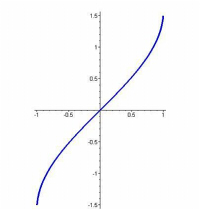
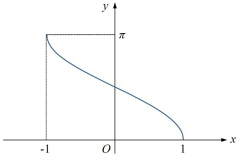
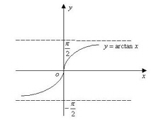

# 1-函数与极限

## 函数

### 一些函数

#### 1. 符号函数

$
sgnx = \begin{cases}
1\quad x>1\\
0\quad x=1\\
-1\quad x<1\\
\end{cases}
$

#### 2. 反三角函数

#### 3. 反双曲函数

$arshx = \ln (x+\sqrt{x^{2}+1})$

$archx = \ln (x+\sqrt{x^{2}-1})$

$arthx = \displaystyle \frac{1}{2}\ln (\frac{1+x}{1-x})$

### 函数的连续性

#### 1. 连续的判据

$\displaystyle \lim_{x \to x_0}f(x) = f(x_0)$

#### 2. 间断点

$\begin{cases}
    左右极限存在 \begin{cases}
        可去间断点 \\
        跳跃间断点 \\
    \end{cases} \\
    左右极限不存在 \begin{cases}
        无穷间断点 \\
        振荡间断点
    \end{cases}
\end{cases}$

#### 3. 性质

1. 在闭区间上连续的函数在该区间上一定有界且一定能取得它的最大值和最小值

2. 零点定理：$f(x)在[a,b]上连续且f(a)与f(b)异号，则存在\delta \in [a,b] 使f(\delta) = 0$

3. 介值定理：$f(x)在[a,b]上连续且f(a) = A, f(b) = B, 则存在\delta \in (a,b) 使 f(\delta) = C, C \in [A, B]$

#### 4. 一致连续性

只要两个自变量接近到一定程度，就可使对应的函数值达到所指定的接近程度

几何表现为能使函数从给定矩形的左右两侧穿过

### 函数图像

#### 1. 斜渐近线

* y = kx + b

$\begin{cases}
    k = \displaystyle \lim_{x \to \infty} \frac{f(x)}{x} \\
    b = \displaystyle \lim_{x \to \infty}(f(x) - kx)
\end{cases}$

## 极限

### 定义

$存在A，对于任意\varepsilon>0，总存在\delta>0，使x满足0<\left\vert x-x_{0} \right\vert <\delta时，\left\vert f(x)-A \right\vert <\varepsilon$

$则\displaystyle \lim_{x \to x_0}f(x) = A$

### 极限的判据

$f(x_0^{-}) = f(x_0^{+})$

### 无穷小

1. $\lim f(x) = A, 则f(x) = A + o$

2. $有界函数 + o = o$

### 运算法则

1. $\lim [f(x) + g(x)] = \lim f(x) + \lim g(x)$

2. $\lim f(x) \cdot g(x) = \lim f(x) \cdot \lim g(x)$

3. $\displaystyle \lim f^{n}(x) = [\lim f(x)]^{n}$

4. $f(x) > g(x), 则\lim f(x) > \lim g(x)$

5. $\lim f(g(x)) = f(\lim g(x))$

6. $\displaystyle \lim f(x)^{g(x)} = \lim f(x)^{\lim g(x)}$

### 极限的计算

#### 1. 夹逼准则

$A(x) \le B(x) \le C(x), 且 \lim A(x) = \alpha, \lim C(x) = \alpha$
$则 \lim B(x) = \alpha$

#### 2. 两个重要极限

   1. $\displaystyle \lim_{x \to 0} \frac{\sin x}{x} = 1$

   2. $\displaystyle \lim_{x \to 0} (1+x)^{\displaystyle \frac{1}{x}} = e$

#### 3. 等价无穷小

* 原理：$f(x) \sim g(x) \implies f(x) = g(x) + o(g(x)) \implies \lim \displaystyle \frac{f(x) - g(x)}{g(x)} = 0$

* $\begin{cases}
  \sin x \sim x \\
  \arcsin x \sim x\\
  \tan x \sim x\\
  \arctan x \sim x\\
  \end{cases}$

* $\begin{cases}
  e^{x}-1 \sim x\\
  \ln (x+1) \sim x\\
  \end{cases}$

* $\begin{cases}
  a^{x}-1 \sim Ina \cdot x\\
  (1+x)^{\alpha}-1 \sim \alpha x
  \end{cases}$

#### 4. 泰勒公式

* 原则：$\begin{cases}
  A-B型：展开至系数不相等的最小项 \\
  \\
  \displaystyle \frac{A}{B}型：将分子（母）展开至分母（子）的幂
  \end{cases}$

* $\begin{cases}
  \sin x = \displaystyle x - \frac{x^{3}}{3！} + o(x^{3}) \\
  \cos x = \displaystyle 1 - \frac{x^{2}}{2!} + o(x^{2}) \\
  \tan x = \displaystyle x + \frac{x^{3}}{3} + o(x^{3})
  \end{cases}$

* $\begin{cases}
  e^{x} = \displaystyle 1+x+\frac{1}{2}x^{2} + o(x^{2}) \\
  \ln (x+1) = \displaystyle x - \frac{1}{2}x^{2} + \frac{1}{3}x^{3} + o(x^{3})
  \end{cases}$

* $\begin{cases}
  (1+x)^{\alpha}  = \displaystyle 1 + \alpha x+ \frac{\alpha (\alpha - 1)}{2}x^{2} + o(x^{2})\\
  \displaystyle \frac{1}{1-x} = 1 + x + x^{2} + o(x^{2})
  \end{cases}$
