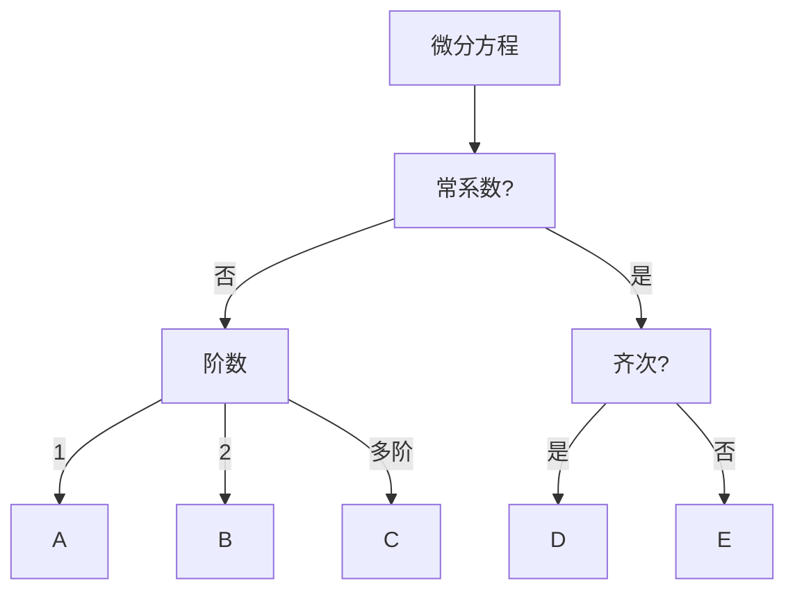

# 解题思路

---

## A.一阶微分方程

1. **分离变量**
    *   常用结论: $\displaystyle \frac{\mathrm{d}y}{\mathrm{d}x} = P(x)y \quad  \Rightarrow \quad y = Ce^{\int P(x)\mathrm{d}x}$
2. **齐次方程**

   *   令 $u = \displaystyle \frac{y}{x}$
   *   则 $\displaystyle \frac{\mathrm{d}y}{\mathrm{d}x} = P(\displaystyle \frac{y}{x}) \quad  \Rightarrow \quad x \frac{\mathrm{d}u}{\mathrm{d}x} + u = P(u)$
3. **一阶线性方程**

   *   $\displaystyle \frac{\mathrm{d}y}{\mathrm{d}x} = P(x)y + Q(x)$
   *   先求得对应齐次通解 $Y = Ce^{\int P(x)\mathrm{d}x}$
   *   再令 $C = u(x)$ 求得 $\displaystyle \frac{\mathrm{d}Y}{\mathrm{d}x} = F(u, x)$
   *   最后带入原方程求得 u

---

## B.二阶微分方程

1. **$y^{''} = f(x,y^{'})$ 型**

   *   令 $p = y^{'}$ 为所有 y 降阶
2. **$y^{''} = f(y,y^{'})$ 型**

   *   令 $p = y^{'}$ 即 $y^{''} = p\displaystyle \frac{\mathrm{d}p}{\mathrm{d}y}$
   *   再替换变量 $p\displaystyle \frac{\mathrm{d}p}{\mathrm{d}y} = f(y,p)$

---

## C.高阶微分方程

* **$\displaystyle \frac{\mathrm{d}y}{\mathrm{d}x}+ p(x)y = Q(x)y^{n}$ 型**
  * 同除 $y^{n}$ 再替换

---

## D.齐次常系数微分方程

* 解特征方程得到
  $\begin{cases}
    k重根r \quad \Rightarrow \quad e^{rx}(C_{1} + C_{2}x + \cdot \cdot \cdot  + C_{k}x^{k-1}) \\
    k对复数根 \alpha + \beta i\quad \Rightarrow \quad \\
    \quad \quad e^{\alpha x}[(C_{1} + C_{2}x + \cdot \cdot \cdot  + C_{k}x^{k-1})\cos \beta x + (C_{1} + C_{2}x + \cdot \cdot \cdot  + C_{k}x^{k-1})\sin \beta x] \\
  \end{cases}$

---

## E.非齐次常系数微分方程

* **解的结构**
  * $f(x) = A$ 的特解为 $y^{*} = a$
  * $f(x) = B$ 的特解为 $y^{*} = b$
  * 则 $f(x) = A+B$ 的特解为 $y^{*} = a+b$

1. **$f(x) = e^{\lambda x}P_{m}(x)$ 型**
    * 设 $y^{*} = x^{k}R_{m}(x)e^{\lambda x}$
    * 其中 k 为特征方程中含根 $\lambda$ 的次数
2. **$f(x) = e^{\lambda x} [P_{l}(x)\cos \omega x + Q_{n}(x) \sin \omega x]$ 型**
    * 设 $y^{*} = x^{k}e^{\lambda x}[R_{m_1}(x)  \cos \omega x + R_{m_2}(x)\sin \omega x]$
    * 其中 k 为特征方程中含根 $\lambda + \omega x$ 的次数
    * $\quad m = \max(l,n)$ 